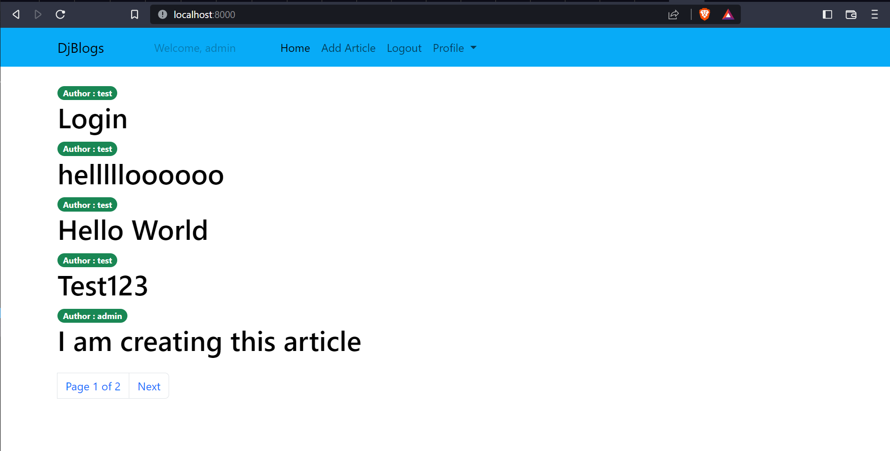

# DjBlogs


> A simple Blogging App to register yourself. Add/Update/Delete your blogs and other user's can view the blogs



---

### Table of Contents

- [Description](#description)
- [Technologies](#technologies)
- [Installation](#installation)
- [Documentation](#documentation)

---

## Description

- A blog application to manage view all the blogs written by users.
- Users can create an account, login/logout and change their password.
- Form validation in the registration Input form.
- Users can view all the blogs, however they can only update their own blogs.
- All the users can view all the blogs created along with the time when it was created/updated irrespective of the user.
- Non logged-in users can view all the blogs.

---

#### Technologies

- Django
- Python
- Bootstrap
- Html/CSS

[Back To The Top](#DjBlogs)

---

## Installation

- Create a virtual environment by using `python -m venv venv`.
- Activate the virtual environment.
- Install the required packages with 
```bash 
pip install -r requirements.txt
```
- Open `Blog/settings.py` and change `DATABASES` dictionary with your database config.
- Migrate the database to the latest version by running 
```bash 
python manage.py migrate
```
- Create a `superuser` by running 
```bash
python manage.py createsuperuser
```
- Provide the asked fields and create an account.
- Create an app by running 
```bash
python manage.py startapp articles
```
- Start the app by running 
```bash 
python manage.py runserver
```
- Open browser to address `localhost:8000`.

[Back To The Top](#DjBlogs)

---

## Documentation

The project is divided into modules
- Accounts
    - Create accounts
    - Password change
    - Logout users

- Articles App
    - Create new blog
    - Edit/Delete the created blogs 

- View
    - View all the blogs irrespective of the user

